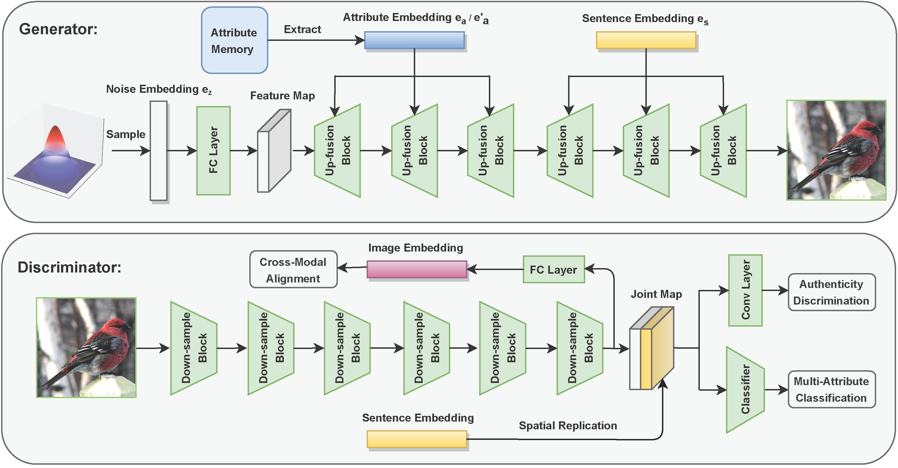

# Adma-GAN: Attribute-Driven Memory Augmented GANs for Text-to-Image Generation (ACMMM 2022)

**Official Pytorch implementation for our paper** [[arxiv]](https://arxiv.org/abs/2209.14046)

## Pipeline


## Experimental Results on CUB-200-2011 and COCO2014


---

## Dataset
1. Download the preprocessed [CUB-200-2011](https://drive.google.com/file/d/1SDVUxKbfFCp9gkYsXqzTa_fl-hFk68eK/view?usp=share_link) dataset. (including the extracted attribute information)
2. Add it to data/CUB-200-2011

## Training
```
cd Adma-GAN/code/
python train.py --config=cfg/bird.yml
```

## Citing
If you find Adma-GAN useful in your research, please consider citing our paper:
```
@inproceedings{wu2022adma,
  title={Adma-GAN: Attribute-Driven Memory Augmented GANs for Text-to-Image Generation.},
  author={Wu, Xintian and Zhao, Hanbin and Zheng, Liangli and Ding, Shouhong and Li, Xi},
  booktitle={Proceedings of the 30th ACM International Conference on Multimedia},
  pages={1593--1602},
  year={2022}
}
```

